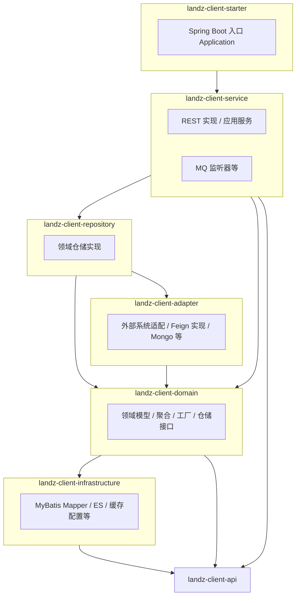

# landz-client-domain 架构与学习指南

> 面向初学者的项目结构说明与自学路径。文档生成基于仓库源码与 `pom.xml` 依赖关系梳理，随代码演进可定期更新。

---

## 1. 项目是什么

**landz-client-domain** 是丽兹行（Landz）体系内的 **客户域微服务**：围绕 **私客、项目客、公客/其他客、带看、报备、微信触点、商机** 等业务提供后端能力。

- **对外形态**：Spring Boot 可执行 JAR，注册到 **Eureka**，配置来自 **Spring Cloud Config**，HTTP 统一前缀 **`/client-domain`**（见 `landz-client-starter` 中的 `bootstrap.yml`）。
- **对内形态**：Maven **多模块** 工程，按 **接口 / 领域 / 应用 / 基础设施 / 适配器 / 启动器** 拆分，并依赖公司内部的 **landz-ddd-***、**framework-core** 等组件。

默认本地配置中 HTTP 端口示例为 **8509**（以你本机或配置中心为准）。

---

## 2. 技术栈一览

| 类别 | 技术 |
|------|------|
| 语言与构建 | Java 17、Maven |
| 应用框架 | Spring Boot 3.2.x、Spring Cloud 2023.0.x |
| 服务发现与远程调用 | Eureka、OpenFeign（`@FeignClient` 定义在 `landz-client-api`） |
| Web 与文档 | Spring Web、Knife4j（OpenAPI 3） |
| 配置 | Spring Cloud Config、Bootstrap |
| 数据访问 | MyBatis-Plus、动态数据源（PostgreSQL 主写、Oracle 老系统）、Druid |
| 缓存 / 搜索 | Redis（Jedis）、Elasticsearch |
| 文档库 | MongoDB（`@EnableMongoRepositories(basePackages = "com.landz.client.mdo")`） |
| 其他 | 消息（RabbitMQ 配置）、Liquibase、EasyExcel、FastDFS API 等 |

---

## 3. Maven 模块与职责

父工程：`landz-client-domain-parent`（根目录 `pom.xml`）。

### 3.1 `landz-client-api`

- **职责**：对外契约——**Feign 接口**、**DTO / Cmd**、**OpenAPI 注解**（`@Tag`、`@Operation`）。
- **特点**：其他微服务通过依赖该 JAR + `@FeignClient` 调用本服务；接口上的 `path` 与实现类上的 `@RequestMapping` 需一致。
- **入口包示例**：`com.landz.client.api.domain`、`com.landz.client.api.aggregate`、`com.landz.client.api.facade`。

### 3.2 `landz-client-domain`（领域模块，注意与仓库根目录同名）

- **职责**：**领域模型**（实体、值对象、领域服务）、**仓储接口**、**工厂**、**领域工具**；依赖 `landz-ddd-core` / `session` / `dict` 等。
- **包结构线索**：按业务子域划分，例如 `client`、`agent`、`wx`、`showing`、`transfer`、`meet`、`track` 等，每个子域下常见 `repository`（接口）、`factory` 等。

### 3.3 `landz-client-infrastructure`

- **职责**：**技术实现层**——MyBatis Mapper 与 XML（`postgresql` / `oracle`）、Elasticsearch、缓存、部分 Spring 配置；**不承载业务编排**，面向持久化与中间件。

### 3.4 `landz-client-adapter`

- **职责**：**防腐层**——封装对外部系统、老接口、微信、推荐等的访问；含 **Mongo 文档**（`com.landz.client.mdo`）等。
- **依赖关系**：依赖 `landz-client-domain`，被 `landz-client-repository` 使用。

### 3.5 `landz-client-repository`

- **职责**：实现 `landz-client-domain` 中定义的 **仓储接口**，组合 **infrastructure + adapter** 完成读写、缓存策略等。

### 3.6 `landz-client-service`

- **职责**：**应用服务层**——实现 `landz-client-api` 中的 Feign 接口（大量 `*ServiceImpl` 上标注 `@RestController`），编排领域对象与仓储；另有 **`listener/mq`** 消费消息、**`aggregate`** 聚合接口实现、**`facade`** 门面等。

### 3.7 `landz-client-starter`

- **职责**：**唯一启动模块**——`Application` 主类、`bootstrap.yml`、打包为可运行 JAR；依赖 `landz-client-service`，并引入 Web、Actuator、Config、Eureka、Feign 等。

---

## 4. 典型请求链路（读代码顺序）

以「私客列表」为例，可按下面顺序跟踪：

1. **`landz-client-api`**：找到 `IPrivateClientService`（`@FeignClient(..., path = "/client-domain/privateClient")`），看方法上的 `@PostMapping`。
2. **`landz-client-service`**：搜索 `implements IPrivateClientService`，打开 `PrivateClientServiceImpl`，看 `@RequestMapping` 是否与 API 中 `path` + 方法路径一致。
3. **向下**：方法内调用的 **领域服务 / 仓储** 在 `landz-client-domain` 的接口与 `landz-client-repository` 的实现之间跳转。
4. **落地**：最终实现会进入 **`landz-client-infrastructure`** 的 Mapper 或 ES、或 **`landz-client-adapter`** 的外部调用。

**提示**：全局搜索接口名或 URL 片段（如 `getPrivateClientList`）比在目录里盲逛更快。

---

## 5. 与 COLA / DDD 的关系

- 父 POM 中出现 **COLA 版本号**，模块划分（api / domain / infrastructure / adapter / app 层在 service）与 **经典 DDD 分层** 一致。
- 公司内部 **`landz-ddd-*`** 提供会话、字典、缓存、队列、Liquibase、Endpoint 等横切能力；具体用法需结合源码与内部文档。
- 实际代码中 **应用服务类既实现接口又承担 `@RestController`**，属于常见折中：学习时把它理解为 **「应用层 + 接入层」** 即可，不必纠结命名是否严格。

---

## 6. 建议你如何「梳理」这个项目

### 6.1 先建立地图（1～2 天）

1. 打开根 `pom.xml`，记住 **七个模块** 名字与顺序。
2. 读 **`Application.java`**：扫包范围、`@EnableFeignClients`、`@EnableMongoRepositories`。
3. 读 **`bootstrap.yml`**：`context-path`、`spring.application.name`、引用的 profile（如 `swagger`、`mongodb`、`rabbitmq`）。

### 6.2 选一条业务线钻透（3～7 天）

任选一条你最关心的业务（例如私客、带看、项目客）：

1. 从 **`landz-client-api`** 的某个 `I*Service` 开始；
2. 跟到 **`*ServiceImpl`**；
3. 列出该方法调用的 **Repository / DomainService / Adapter**；
4. 最后看 **Mapper XML 或 ES 查询** 各一步。

用笔记本或思维导图记录：**接口 → 实现类 → 核心方法 → 表/索引/外部系统**。

### 6.3 横向补齐基础设施

- **多数据源**：`dynamic-datasource`，注意 PostgreSQL 与 Oracle 的分工（根 POM 注释中有「老系统适配」）。
- **消息**：`service/listener/mq` 下各类 `*Listener`，结合配置里的 RabbitMQ。
- **定时与任务**：`TaskServiceImpl`、`ScheduledTaskServiceImpl` 等与 `task`、调度相关的类。

### 6.4 工具建议

- IDE：**Navigate → Implementation**、**Find Usages**、**Call Hierarchy**。
- 全文搜索：**接口名、URL 路径、表名**（Mapper XML 中）。
- 运行：需 **Config Server、Eureka、数据库** 等公司环境时，以团队文档为准；本地可先以「能编译、能单测」为目标。

---

## 7. 学习路径（后端新手）

| 阶段 | 内容 |
|------|------|
| 基础 | Java 语法与集合、Maven 生命周期、Spring IoC / Bean、Spring MVC 请求映射 |
| 进阶 | Spring Boot 自动配置、多环境配置、事务 `@Transactional` |
| 微服务 | 服务注册发现（Eureka）、远程调用（OpenFeign）、配置中心概念 |
| 数据 | MyBatis / MyBatis-Plus 基本用法、动态数据源概念、Redis 作缓存的常见模式 |
| 架构 | DDD 分层、仓储模式、适配器模式；能读懂本仓库的分模块边界即可 |

---

## 8. 文档维护说明

- **路径**：本文件位于仓库 `docs/架构与学习指南.md`。
- **更新时机**：模块增减、重大技术栈升级、默认端口或 `context-path` 变更时，建议同步修改本文档。

---

*祝学习顺利。若你希望针对某一条业务线（例如仅「带看」或仅「私客」）再拆一版更细的阅读清单，可以指定模块名或接口名继续细化。*
